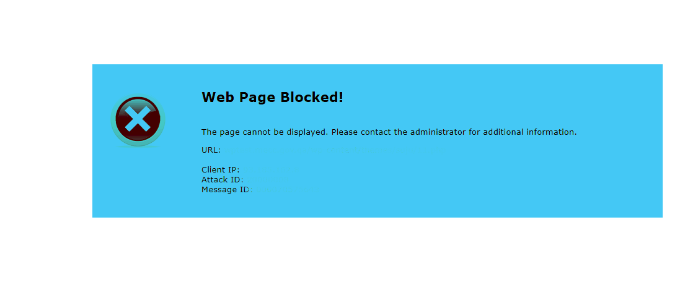

# 🖥️ TERMINAL BYPASS - WEB PAGE BLOCKED! 💥





---

**TERMINAL BYPASS** adalah web-based command executor (terminal) berbasis PHP yang memungkinkan kamu menjalankan perintah sistem langsung dari browser, bahkan jika halaman web diblokir oleh WAF, firewall, atau ISP.

---

## 🔍 Kegunaan

- 🔓 **Bypass halaman error seperti "Web Page Blocked", "Access Denied", dll.**
- 🖥️ **Jalankan perintah langsung dari browser**
- 🧪 **Debug atau akses server ketika SSH tidak tersedia**
- 🚀 Cocok untuk pentest, C2 panel sederhana, atau edukasi jaringan

---

## ⚙️ Fitur Utama

✨ Eksekusi perintah via `proc_open()`  
🔐 Input command di-*encode* dengan base64  
🧪 Menampilkan `stdout`, `stderr`, dan `exit code`  
🕶️ Payload obfuscated `eval(gzinflate(base64_decode(...)))` *(opsional, bisa dihapus)*  
🎨 Tampilan antarmuka sederhana dan ringan  
🌐 Bisa dijalankan di hampir semua shared hosting  

---
## 📸 Tampilan

```text
+-------------------------------------------+
|    TERMINAL BYPASS WEB PAGE BLOCKED!     |
+-------------------------------------------+
Masukkan Perintah CMD:
[___________ id ____________] [Jalankan]
Output:
uid=33(www-data) gid=33(www-data) groups=33(www-data)

```
---

## ⚠️ PERINGATAN & DISCLAIMER

> 🚨 **PERINGATAN: Tools ini hanya untuk penggunaan legal & edukasi.**  
> ❌ **Jangan gunakan di server yang bukan milikmu atau tanpa izin eksplisit.**  
> 🧑‍⚖️ **Segala bentuk penyalahgunaan adalah tanggung jawab pengguna sepenuhnya.**  
> 🛡️ **Pembuat tidak bertanggung jawab atas segala kerusakan, kerugian, atau pelanggaran hukum yang timbul dari penggunaan tool ini.**

---

